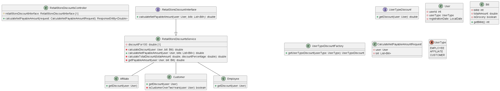

# Retail Store Discounts Project

## Overview
The Retail Store Discounts project is a Spring Boot application that provides discount calculations for users based on certain criteria. The application calculates the net payable amount for a given bill by applying various discounts depending on the user type and bill details.

## Use Case
On a retail website, the following discounts apply:

- If the user is an employee of the store, they get a 30% discount.
- If the user is an affiliate of the store, they get a 10% discount.
- If the user has been a customer for over 2 years, they get a 5% discount.
- For every $100 on the bill, there would be a $5 discount (e.g. for $990, you get $45 as a discount).
- The percentage-based discounts do not apply to groceries.
- A user can get only one of the percentage-based discounts on a bill.

**Note: I am considering ($100 on the bill, there would be a $5 discount) is not a percentage base discount.**

## Features
- Calculate the net payable amount for a bill based on user and bill information.
- Apply appropriate discounts based on user type and bill details.
- Support for custom validation of user type and bill amount.

## Getting Started
To run the Retail Store Discounts project locally, follow these steps:

1. Clone the repository: `git clone https://github.com/Nkm17000/retail_discount.git`
2. Navigate to the project directory: `cd retail_discount`
3. checkout master branch in git that had final code : `checkout master`
4. Build the project: `gradle clean build`
5. Run the application: `gradle bootRun`
6. open this in browser http://localhost:8080/swagger-ui/index.html


### If you wanted to run executable jar 
1. I have kept executable jar in sampleOutputResult Folder
2. go to executable jar path in cmd
3. type command:  `java -jar demo-0.0.1-SNAPSHOT.jar java -jar --server.port=8080`
4. open this in browser http://localhost:8080/swagger-ui/index.html

### code coverage
1. go to build/jococoHtml/index.html
2. open this file in browser
3. check your code coverage here
4. [Link to Jacoco HTML Report](sampleOutputResults/jacocoHtml/index.html)
   
### code lint
1. go to build/checkstyle/main.html
2. check if you have any lint issue
3. fix it manually 
4. for automatic fix you can run : `./gradlew rewriteRun`


## Usage
Once the application is running, you can interact with it using the provided REST API. The main endpoint for calculating the net payable amount is:

##POST /calculateNetPayableAmount Or use swagger api : http://localhost:8080/swagger-ui/index.html

Provide a JSON payload containing the user and bill details, and the application will return the net payable amount.

### Sample Request Payload
```json
{
  "user": {
    "userId": 1,
    "userType": "EMPLOYEE",
    "registrationDate": "2024-02-09"
  },
  "bill": [
    {
      "billId": 1,
      "totalAmount": 1000,
      "grocery": false
    },
    {
      "billId": 2,
      "totalAmount": 1000,
      "grocery": true
    }
  ]
}
```
### Sample Response
{
  "netPayableAmount": 1615.0
}

### Technologies Used
- Java 17
- Spring Boot
- gradle
- Swagger for API documentation
- Slf4j for logs

# Running SonarQube Analysis
## Prerequisites
- Run the application: `docker compose up -d`
- sonarqube will be running on localhost:9090
- goto Account setting and setup token 
- set this token id at gradle sonar properties like sonar.projectKey and sonar.token
### Run the following Gradle command to execute SonarQube analysis:
- Run the application: `gradle sonarqube`
  
  
  
  


# high level UML Diagram




1. The User class represents a user of the store with properties userType and registrationDate.
2. The UserType enum represents the different types of users, each with a corresponding discount percentage.
3. Each user type (EMPLOYEE, AFFILIATE, CUSTOMER) has its own discount percentage, which can be accessed using the getDiscountPercentage() method.
4. The User class has getters for userType and registrationDate.
